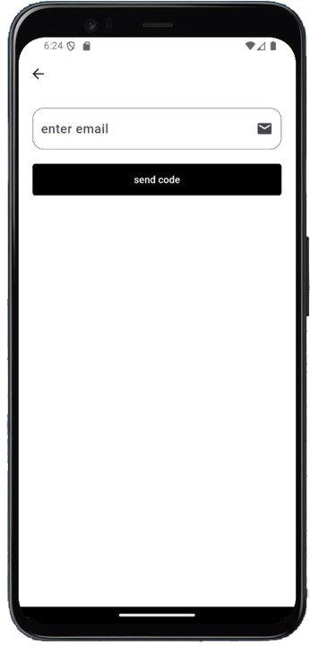
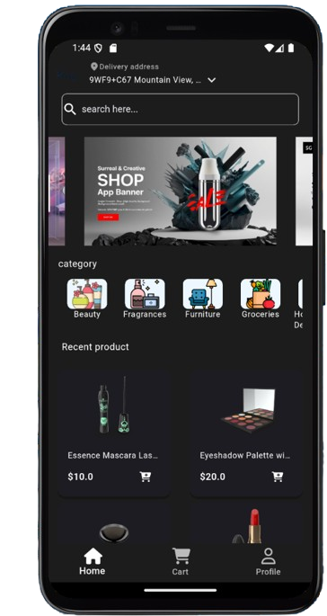

# 🛍️ Shopy — Flutter E-Commerce App

> **Shopy** is a complete e-commerce mobile application built with Flutter and Firebase, packed with real-world features like authentication, payments, search, and map integration.  
> This app is built from scratch, fully functional, and structured to scale.

---

## 🚀 Features Overview

## 🔐 Authentication
- Email/Password login & registration (Firebase Auth)
- Google Sign-In
- Forgot Password via email

## 🛒 Shopping Experience
- Product browsing with categories
- View product details
- Add to cart
- Stripe payment integration
- Real-time Firestore database

## 🌍 Localization & Theming
- Fully localized: 🇺🇸 English & 🇪🇬 Arabic
- Dark & Light Mode switching
- Directional layout (RTL/LTR)

## 📍 Maps Integration
- Google Maps to detect user location
- Permission handling included

## 🔎 Other Features
- Product search
- Responsive design
- Clean Cubit state management
- Dio for REST API handling

---

## 📸 Screenshots

### 🌞 Light Mode

| | |
|--|--|
|  |  |
|  |  |
|  |  |
|  |  |
|  |  |
|  |  |
|  |  |

---

### 🌙 Dark Mode

| | |
|--|--|
|  |  |

---

### 🌍 Localization

### 🌍 Localization (Arabic)

 | 

---

## ❓ Why Shopy?

- 🔧 Real-world features from login to payment
- ⚙️ Clean code with scalable folder structure
- 🧱 Uses modern Flutter tools (Dio, Cubit, Firebase, Stripe)
- 🧠 Solves common problems: loading states, errors, etc.
- 📱 Designed to be user-friendly and developer-readable
- 🧱 Structured using MVVM for better testability and separation of concerns

---

## 🧰 Tech Stack

- **Flutter 3.19**
- **Firebase Auth & Firestore**
- **Stripe API**
- **Google Maps SDK**
- **Cubit (State Management)**
- **Dio (Networking)**
- **Shared Preferences**
- **Flutter Intl (Localization)**
- **MVVM Architecture** (Model–View–ViewModel pattern)

---
> I built this app as a hands-on project to sharpen my skills and demonstrate my capabilities as a Flutter developer. Open to feedback and collaboration.
